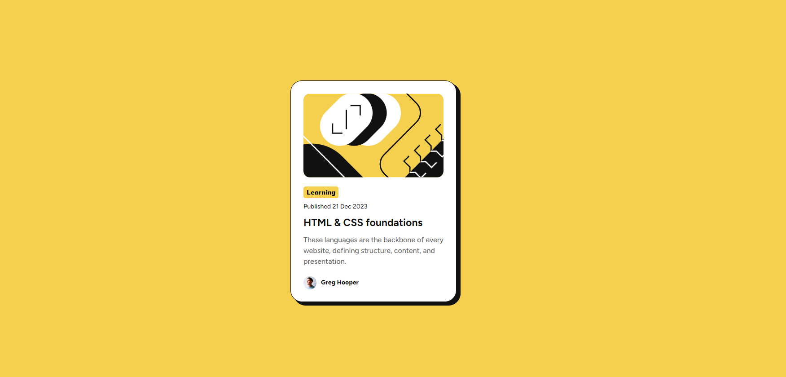
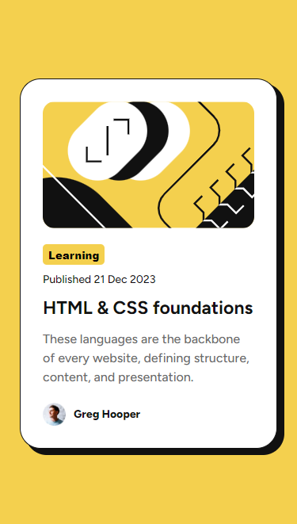
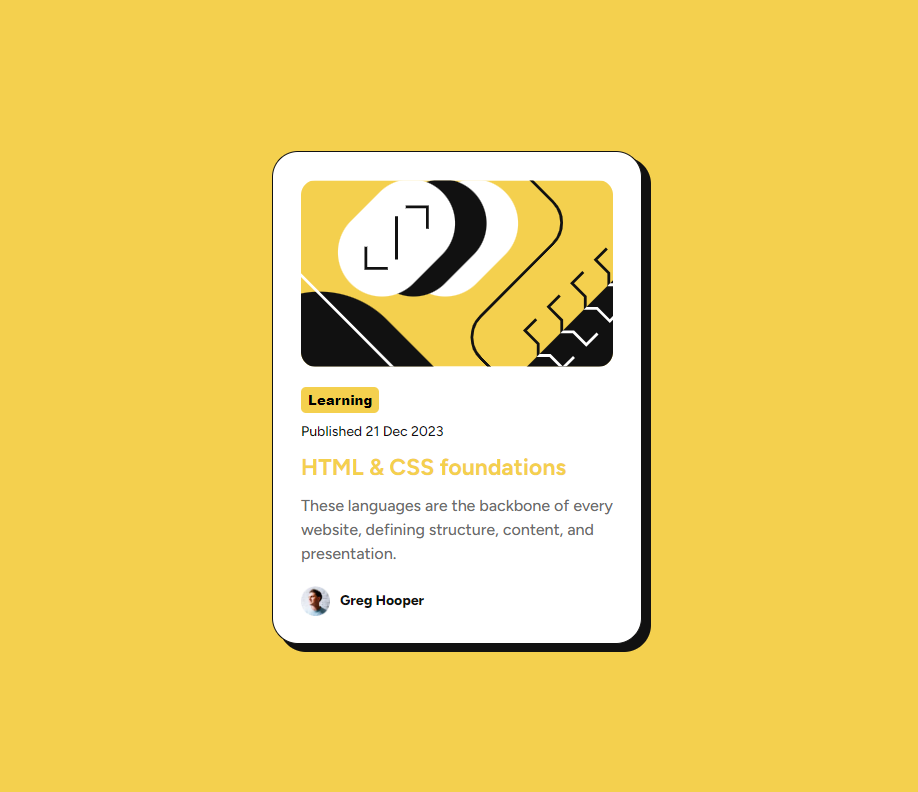

Sure, here is a README file for your project based on the format you provided:

# Frontend Mentor - Blog preview card solution

This is a solution to the [Blog preview card challenge on Frontend Mentor](https://www.frontendmentor.io/challenges/blog-preview-card-ckPaj01IcS). Frontend Mentor challenges help you improve your coding skills by building realistic projects.

## Table of contents

- [Overview](#overview)
  - [The challenge](#the-challenge)
  - [Screenshot](#screenshot)
  - [Links](#links)
- [My process](#my-process)
  - [Built with](#built-with)
  - [What I learned](#what-i-learned)
  - [Continued development](#continued-development)
  - [Useful resources](#useful-resources)
- [Author](#author)
- [Acknowledgments](#acknowledgments)

## Overview

### The challenge

Users should be able to:

- See hover and focus states for all interactive elements on the page

### Screenshot





### Links

- Solution URL: [GitHub](https://github.com/Hilton-J/blog-preview-card.git)
- Live Site URL: [Add live site URL here](https://your-live-site-url.com)

## My process

### Built with

- Semantic HTML5 markup
- CSS custom properties
- Flexbox
- Desktop-first workflow
- [React](https://reactjs.org/) - JS library
- [Vite](https://vitejs.dev/) - Build tool

### What I learned

I learned how to implement hover and focus states in React components. I also learned how to make the image resize with its container. I also got more comfortable using CSS custom properties and Flexbox for layout management. Here are some code snippets that I'm proud of:

```html
<div className="container">
  <article className="card">
    <div className="card_image">
      
    </div>
    <div className="card_text">
      <button className="btn pair">Learning</button>
      <h4>Published 21 Dec 2023</h4>
      <h1>HTML & CSS foundations</h1>
      <p>
        These languages are the backbone of every website, defining structure,
        content, and presentation.
      </p>
    </div>
    <div className="card_user">
      <div className="user_image"></div>
      <p className="pair">Greg Hooper</p>
    </div>
  </article>
</div>
```

```css
.container {
  background: var(--color-bg);
  height: 100vh;
  display: flex;
  justify-content: center;
  align-items: center;
}

.card {
  -webkit-box-shadow: 8px 7px 0px 1px rgba(17, 17, 17, 1);
  -moz-box-shadow: 8px 7px 0px 1px rgba(17, 17, 17, 1);
  box-shadow: 8px 7px 0px 1px rgba(17, 17, 17, 1);

  border: 1px solid var(--color-primary);

  -webkit-border-radius: 26px;
  -moz-border-radius: 26px;
  border-radius: 26px;

  padding: 2em;
  margin: 2em;
  width: 370px;
  min-width: 325px;
  background: var(--color-white);
  height: auto;
}

.card_image {
  border-radius: 15px;
  overflow: hidden;
  object-position: center;
  display: flex;
  justify-content: center;
  width: 100%;
}

.card_text {
  margin-top: 20px;
}

.pair {
  font-weight: 800;
}

.btn {
  padding: 3.5px 7px;
  border-radius: 5px;
  background: var(--color-bg);
}

.card_text > h4 {
  font-weight: 500;
  margin-top: 10px;
}

.card_text > h1 {
  font-size: 23px;
  line-height: 150%;
  font-weight: bold;
  margin: 10px 0;
  transition: all 400ms ease;
  cursor: pointer;
}

.card_text > p {
  font-size: 16px;
  color: var(--color-secondary);
  line-height: 150%;
  font-weight: 500;
}

.card_user {
  display: flex;
  align-items: center;
  gap: 10px;
  margin-top: 20px;
}

.user_image {
  height: 29px;
  width: 29px;
}

.card_text > h1:hover {
  color: var(--color-bg);
}
```

### Continued development

In future projects, I want to focus more on accessibility and performance optimization. Additionally, I want to get more comfortable with CSS Grid and advanced React patterns.

### Useful resources

- [CSS Tricks](https://css-tricks.com) - This helped me understand Flexbox and CSS custom properties better.
- [React Documentation](https://reactjs.org/docs/getting-started.html) - This is always a great resource for understanding React concepts and best practices.

## Author

- Website - [Your Name](https://www.your-site.com)
- Frontend Mentor - [@Hilton-J](https://www.frontendmentor.io/profile/Hilton-J)

## Conclusion

I would like to thank the Frontend Mentor for this challenge, and for the support from the community.

Feel free to scrutinise the code and advise if I am violating any CSS best practices. As I am learning CSS, your feedback is vital to my learning and appreciated. Feel free to also edit or add more details to personalize this README further!
